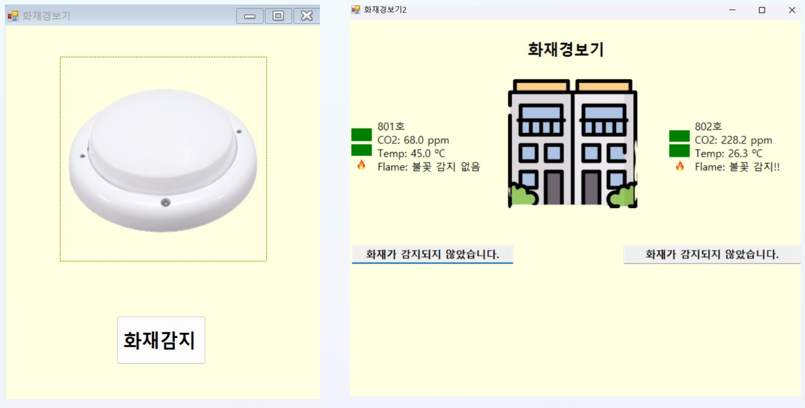

# 24-1_FireDetector

IoT 스마트 화재감지기 관리 시스템

본 프로젝트는 화재경보기의 오작동·미작동으로 인한 인명 피해를 줄이기 위한 IoT 기반 화재 감지 및 원격 모니터링 시스템이다.

경기도 소방재난본부가 2024년 3월 발표한 자료에 따르면, 최근 10년간(2014~2023) 경기지역 주택화재 1만 3,488건을 전수조사한 결과 화재경보기가 작동한 경우(589건, 사망 9명, 사망률 1.53%)와 작동하지 않은 경우(2,576건, 사망 53명, 사망률 2.06%)의 사망률 차이가 약 1.3배로 나타났다. 이는 화재경보기가 정상적으로 작동하는 것만으로도 인명피해를 유의미하게 줄일 수 있음을 시사한다.

본 시스템은 화재감지기 하나만 관리하는 기존 제품과 달리, 복수의 화재감지기 데이터를 서로 비교하여 특정 감지기의 오작동 의심 상황까지 감지하고, 관리자가 원격에서 실시간으로 화재 상황을 확인할 수 있도록 구현하였다.

## App Screenshots



좌측은 화재감지기 초기 실행 화면, 우측은 801호/802호 센서 데이터를 실시간으로 모니터링하는 대시보드 화면이다. CO2·온도 임계값을 초과하면 표시 색상이 빨간색으로 바뀌며 화재 감지 여부를 텍스트로 안내한다.

## Project Overview

Arduino Wemos D1 R1 (온습도·CO2·불꽃 센서)
→ Wi-Fi 통신 (ESP8266)
→ Firebase Realtime Database 전송
→ C# WinForms 앱 (Form1) Firebase 연동 확인
→ Form2 진입, 3초 주기 Timer로 데이터 갱신
→ 두 호실(801호/802호) 센서 데이터 비교
→ 화재 판단 로직 및 센서 오류 판정
→ PictureBox 색상 변화 + 텍스트 알림으로 시각화

## Main Features

- 아두이노(Wemos D1 R1, ESP8266 Wi-Fi 칩셋) 기반 온도·CO2·불꽃 센서 데이터 수집
- Firebase Realtime Database를 통한 센서 데이터 실시간 동기화
- 다중 호실(801호/802호) 센서 데이터 동시 모니터링
- 3초 주기 Timer 기반 실시간 데이터 갱신
- 화재 판단 로직: 아래 3개 조건 중 2개 이상 충족 시 화재로 판단
  - 온도: 두 호실 중 한쪽이 다른 쪽보다 20도 이상 높음
  - CO2: 800ppm 이상
  - 불꽃 감지: 감지됨 (HIGH)
- 센서 오류 판정: CO2 오차 200, 온도 오차 20도 기준으로 이상값 발생 시 오류 메시지 박스 출력
- CO2·온도 수치에 따른 PictureBox 색상 자동 변경 (평상시 초록색, 화재감지 수치 도달 시 빨간색)
- Firebase 연동 성공/실패 여부 메시지박스 안내

## Project Structure

```
24-1_FireDetector/
├── Project_Fire.sln
├── Project_Fire.csproj
├── App.config
├── packages.config
│
└── Source/
    ├── Program.cs           # 애플리케이션 진입점
    ├── Data.cs               # 센서 데이터 모델
    ├── Form1.cs               # Firebase 연동 확인, 초기 데이터 조회
    ├── Form1.Designer.cs
    ├── Form2.cs               # 실시간 모니터링 대시보드, 화재 판단 로직
    ├── Form2.Designer.cs
    └── Properties/            # 어셈블리 정보 및 설정
```

## Source Code Description

| Path | Description |
|---|---|
| `Source/Program.cs` | WinForms 애플리케이션 진입점, Form1 실행 |
| `Source/Data.cs` | CO2, Temperature, Flame 값을 담는 센서 데이터 모델 클래스 |
| `Source/Form1.cs` | Firebase 연동 확인 메시지 처리, 두 호실의 센서 데이터 최초 조회 후 Form2로 전달 |
| `Source/Form2.cs` | 3초 주기 Timer로 데이터 갱신, 화재 판단 로직, 센서 오류 판정, PictureBox 색상 및 텍스트 알림 처리 |

## Hardware

| 구성요소 | 사양 |
|---|---|
| 보드 | Wemos D1 R1 (ESP8266EX, 80MHz, Wi-Fi 802.11 b/g/n) |
| CO2 센서 | MQ-135 (감지범위 10~1000ppm, 아날로그 출력) |
| 온습도 센서 | DHT11 (온도 0~50℃, ±2℃ 정확도) |
| 불꽃 감지 센서 | 적외선(IR) 방식, 감지파장 760~1100nm, 감지각도 약 60도 |
| 외형 | Tinkercad 3D 모델링 → 3D 프린터 출력 (2개 호실 구조, 센서 4개 노출 설계) |

## Requirements

- .NET Framework 4.7.2
- Visual Studio 2019 이상
- FireSharp (Firebase Realtime Database .NET 클라이언트, NuGet으로 자동 복원)
- Arduino IDE (ESP8266 보드 매니저, ArduinoJson, Firebase-ESP8266 라이브러리)

## How to Run

1. Firebase 콘솔에서 프로젝트를 생성하고 Realtime Database의 `.read`/`.write` 권한을 `true`로 설정한다.
2. Arduino IDE에서 Wi-Fi 정보와 Firebase 주소·비밀번호를 설정한 뒤 보드에 업로드한다.
3. `Project_Fire.sln`을 Visual Studio로 열고, 프로젝트 우클릭 → NuGet 패키지 복원을 실행한다.
4. `App.config`의 `FirebaseAuthSecret`, `FirebaseBasePath` 값을 본인의 Firebase 프로젝트 정보로 교체한다.
5. F5로 빌드 및 실행 후, 화재감지 버튼을 클릭해 Firebase 연동 여부를 확인한다.

## Configuration

Firebase 인증 정보는 코드에 하드코딩하지 않고 `App.config`의 `appSettings`에서 읽어온다.

```xml
<appSettings>
    <add key="FirebaseAuthSecret" value="YOUR_FIREBASE_AUTH_SECRET_HERE" />
    <add key="FirebaseBasePath" value="https://YOUR_PROJECT.firebaseio.com/" />
</appSettings>
```

본인의 Firebase 프로젝트 Database Secret과 프로젝트 URL로 값을 교체한 뒤 빌드해야 한다.

## Development Background

2014~2023년 경기지역 주택화재 통계에서 화재경보기 작동 여부에 따른 사망률 차이(1.3배), 그리고 화재경보기를 강제로 꺼두었던 경북 문경 공장화재 사례(소방관 2명 순직)를 계기로, "오작동·미작동을 줄이면서 여러 대의 감지기를 통합 관리"하는 시스템의 필요성에서 출발했다. 국내외 유사 제품(온테크 시스템, 엘디티, Google Nest Protect)은 대부분 단일 감지기 관리 또는 원격 통신에 국한되어 있어, 복수 감지기 간 상호 비교를 통한 오작동 의심 판별 기능을 차별점으로 두었다.

## Team

| 역할 | 담당 | 내용 |
|---|---|---|
| 과제책임자 | 조은채 | 대외 보고 및 제출 총괄, 아두이노 회로 연결 및 코딩 |
| **실무 총괄** | **송성헌** | **프로젝트 기획 및 설계 주도, 아두이노-Firebase-C# 전체 연동, 외형 디자인, 팀 운영** |
| 개발 | 장미 | C# 디자인 및 코드 연구 |

## Notes

본 프로젝트는 IoT 화재 감지 시스템의 팀 프로젝트 결과물이다. 화재 판단 임계값(온도차 20도, CO2 800ppm)은 실제 센서 테스트를 통해 설정한 프로젝트 실험값으로, 공인 화재 안전 기준을 대체하지 않는다.
